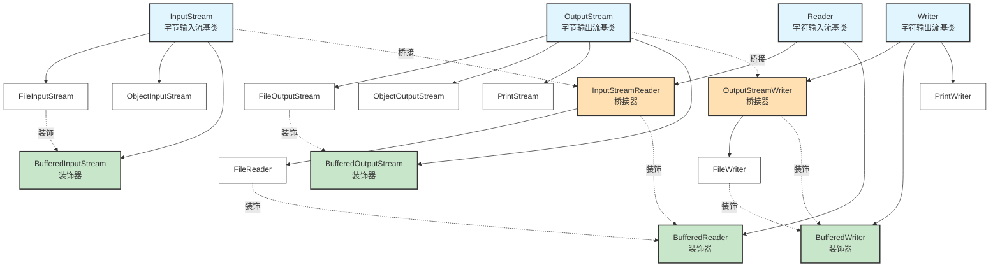

# Java IO 流继承与装饰体系

---

## 一、核心体系图



---

## 二、四大抽象基类

| 分类 | 字节流 | 字符流 |
|:----:|:------:|:------:|
| **输入流** | InputStream | Reader |
| **输出流** | OutputStream | Writer |

**选择原则：**
- 处理**文本文件** → 使用字符流（Reader/Writer）
- 处理**二进制文件**（图片、视频等） → 使用字节流（InputStream/OutputStream）

---

## 三、主要实现类

### 3.1 字节流（InputStream / OutputStream）

#### 输入流（InputStream）

| 类名 | 作用 | 类型 |
|------|------|:----:|
| FileInputStream | 从文件读取字节 | 节点流 |
| ObjectInputStream | 读取对象（反序列化） | 处理流 |
| BufferedInputStream | 提供缓冲，提高效率 | 装饰器 |

#### 输出流（OutputStream）

| 类名 | 作用 | 类型 |
|------|------|:----:|
| FileOutputStream | 向文件写入字节 | 节点流 |
| ObjectOutputStream | 写入对象（序列化） | 处理流 |
| PrintStream | 打印流（如 System.out） | 处理流 |
| BufferedOutputStream | 提供缓冲，提高效率 | 装饰器 |

---

### 3.2 字符流（Reader / Writer）

#### 输入流（Reader）

| 类名 | 作用 | 类型 |
|------|------|:----:|
| FileReader | 从文件读取字符 | 节点流 |
| InputStreamReader | 字节流→字符流转换 | 桥接器 |
| BufferedReader | 提供缓冲，支持按行读取 | 装饰器 |

#### 输出流（Writer）

| 类名 | 作用 | 类型 |
|------|------|:----:|
| FileWriter | 向文件写入字符 | 节点流 |
| OutputStreamWriter | 字节流→字符流转换 | 桥接器 |
| BufferedWriter | 提供缓冲，提高效率 | 装饰器 |
| PrintWriter | 打印字符流，支持格式化 | 处理流 |

---

## 四、设计模式

### 4.1 装饰器模式（Decorator）

**作用：** 动态地给对象添加额外功能，不改变其结构

**示例：**

```java
// 给 FileInputStream 添加缓冲功能
InputStream fis = new FileInputStream("file.txt");
InputStream bis = new BufferedInputStream(fis);

// 给 FileReader 添加缓冲和按行读取功能
Reader fr = new FileReader("file.txt");
Reader br = new BufferedReader(fr);
```

**特点：**
- 装饰器类继承自抽象基类
- 构造方法接收同类型对象
- 在原功能基础上增强

---

### 4.2 桥接器模式（Bridge）

**作用：** 连接字节流和字符流，实现编码转换

**示例：**

```java
// 字节流 → 字符流（可指定编码）
InputStream is = new FileInputStream("file.txt");
Reader isr = new InputStreamReader(is, "UTF-8");

// 字节流 → 字符流（输出）
OutputStream os = new FileOutputStream("file.txt");
Writer osw = new OutputStreamWriter(os, "UTF-8");
```

**关键类：**
- `InputStreamReader`：InputStream → Reader
- `OutputStreamWriter`：OutputStream → Writer

---

## 五、常用组合

### 5.1 高效读取文本文件

```java
// 推荐：缓冲 + 按行读取
BufferedReader br = new BufferedReader(
    new FileReader("file.txt")
);
String line;
while ((line = br.readLine()) != null) {
    System.out.println(line);
}
br.close();
```

---

### 5.2 高效写入文本文件

```java
// 推荐：缓冲写入
BufferedWriter bw = new BufferedWriter(
    new FileWriter("file.txt")
);
bw.write("Hello World");
bw.newLine();  // 写入换行符
bw.close();
```

---

### 5.3 字节流转字符流（指定编码）

```java
// 读取：字节流 → 字符流 + 缓冲
BufferedReader br = new BufferedReader(
    new InputStreamReader(
        new FileInputStream("file.txt"), 
        "UTF-8"
    )
);

// 写入：字节流 → 字符流 + 缓冲
BufferedWriter bw = new BufferedWriter(
    new OutputStreamWriter(
        new FileOutputStream("file.txt"), 
        "UTF-8"
    )
);
```

---

### 5.4 对象序列化

```java
// 写入对象
ObjectOutputStream oos = new ObjectOutputStream(
    new BufferedOutputStream(
        new FileOutputStream("object.dat")
    )
);
oos.writeObject(myObject);
oos.close();

// 读取对象
ObjectInputStream ois = new ObjectInputStream(
    new BufferedInputStream(
        new FileInputStream("object.dat")
    )
);
MyObject obj = (MyObject) ois.readObject();
ois.close();
```

---

### 5.5 使用 try-with-resources（推荐）

```java
// 自动关闭流，避免资源泄露
try (BufferedReader br = new BufferedReader(
        new FileReader("file.txt"))) {
    String line;
    while ((line = br.readLine()) != null) {
        System.out.println(line);
    }
} catch (IOException e) {
    e.printStackTrace();
}
```

---

## 六、核心知识点

### 6.1 字节流 vs 字符流

| 对比项 | 字节流 | 字符流 |
|--------|--------|--------|
| **处理单位** | 字节（8 bit） | 字符（16 bit） |
| **适用场景** | 所有类型文件 | 文本文件 |
| **编码处理** | 不涉及编码 | 内部处理编码 |
| **基类** | InputStream/OutputStream | Reader/Writer |

---

### 6.2 节点流 vs 处理流

| 类型 | 说明 | 示例 |
|------|------|------|
| **节点流** | 直接连接数据源 | FileInputStream、FileReader |
| **处理流** | 包装其他流，提供额外功能 | BufferedInputStream、BufferedReader |

**处理流的优势：**
- 提高性能（缓冲流）
- 简化操作（readLine()）
- 增强功能（对象序列化）

---

### 6.3 为什么要使用缓冲流？

1. **减少系统调用**：内部维护缓冲区，批量读写
2. **显著提升性能**：减少磁盘 IO 次数
3. **额外功能**：如 BufferedReader 的 readLine()

**性能对比：**
```java
// 慢：每次读取一个字节
FileInputStream fis = new FileInputStream("file.txt");
int data;
while ((data = fis.read()) != -1) { }

// 快：使用缓冲区批量读取
BufferedInputStream bis = new BufferedInputStream(
    new FileInputStream("file.txt")
);
int data;
while ((data = bis.read()) != -1) { }
```

---

## 七、面试高频问题

### Q1: 字节流和字符流的区别？

**答：**
- **处理单位**：字节流 8 bit，字符流 16 bit
- **适用场景**：字节流处理所有文件，字符流专门处理文本
- **编码问题**：字符流内部处理编码，字节流不涉及
- **性能**：处理文本时字符流更高效

---

### Q2: 什么是装饰器模式？

**答：**
装饰器模式在不改变对象结构的情况下动态添加功能。

**IO 中的体现：**
- BufferedInputStream 装饰 FileInputStream → 添加缓冲
- BufferedReader 装饰 FileReader → 添加缓冲和按行读取
- 装饰器和被装饰类继承自同一基类

---

### Q3: InputStreamReader 和 FileReader 的区别？

**答：**
- **InputStreamReader**：字节流→字符流桥接器，可指定编码
- **FileReader**：继承自 InputStreamReader，使用系统默认编码

**推荐：**
```java
// 推荐：明确指定编码
Reader reader = new InputStreamReader(
    new FileInputStream("file.txt"), "UTF-8"
);

// 不推荐：使用默认编码，可能乱码
Reader reader = new FileReader("file.txt");
```

---

### Q4: 如何正确关闭流？

**答：**
使用 try-with-resources 自动关闭：

```java
try (BufferedReader br = new BufferedReader(
        new FileReader("file.txt"))) {
    // 使用流
} catch (IOException e) {
    e.printStackTrace();
}
// 自动关闭，无需手动 close()
```

**注意：**
- 关闭外层流会自动关闭内层流
- 避免资源泄露
- 多个流用分号分隔

---

### Q5: 为什么要使用缓冲流？

**答：**
- **性能提升**：减少系统调用次数，批量读写
- **额外功能**：BufferedReader 提供 readLine()
- **推荐使用**：几乎所有场景都应该使用缓冲流

---

## 八、使用建议

1. ✅ **优先使用缓冲流**：BufferedXXX 显著提升性能
2. ✅ **使用 try-with-resources**：自动关闭流，避免泄露
3. ✅ **明确指定编码**：使用 InputStreamReader/OutputStreamWriter 时指定 UTF-8
4. ✅ **选择合适的流**：
   - 文本文件 → 字符流
   - 二进制文件 → 字节流
   - 对象序列化 → ObjectInputStream/ObjectOutputStream
5. ✅ **合理组合**：节点流 + 处理流，如 BufferedReader + FileReader

---

## 九、记忆口诀

```
四大基类要记牢：InputStream、OutputStream、Reader、Writer
字节处理用 Stream，字符处理用 Reader/Writer
节点流直连数据源，处理流包装添功能
缓冲装饰提性能，桥接转换字节字符
关闭资源用 try-with，编码明确防乱码
```

---

## 十、快速参考表

| 需求 | 推荐方案 |
|------|----------|
| 读取文本文件 | BufferedReader + FileReader |
| 写入文本文件 | BufferedWriter + FileWriter |
| 读取二进制文件 | BufferedInputStream + FileInputStream |
| 写入二进制文件 | BufferedOutputStream + FileOutputStream |
| 指定编码读取 | BufferedReader + InputStreamReader |
| 指定编码写入 | BufferedWriter + OutputStreamWriter |
| 对象序列化 | ObjectOutputStream + BufferedOutputStream |
| 对象反序列化 | ObjectInputStream + BufferedInputStream |
| 按行读取 | BufferedReader.readLine() |
| 格式化输出 | PrintWriter 或 PrintStream |
