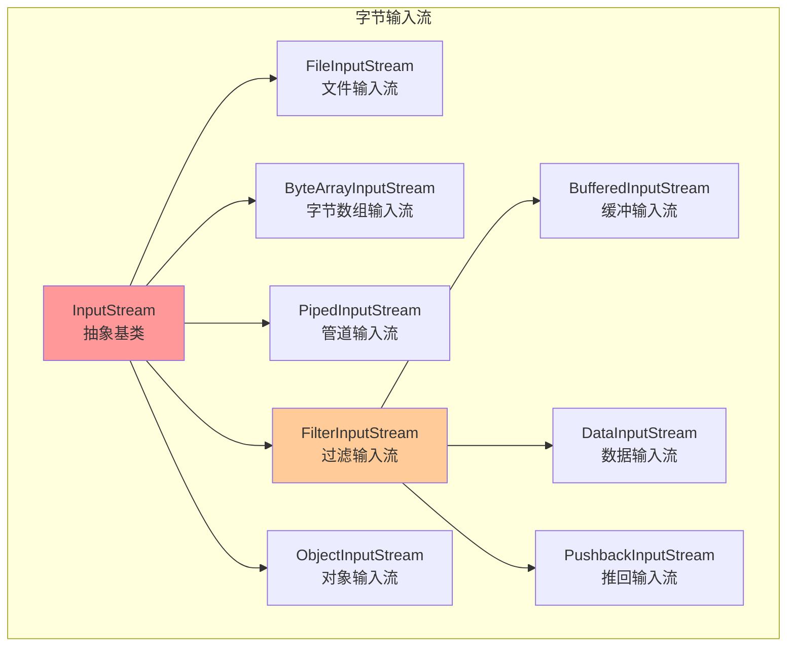
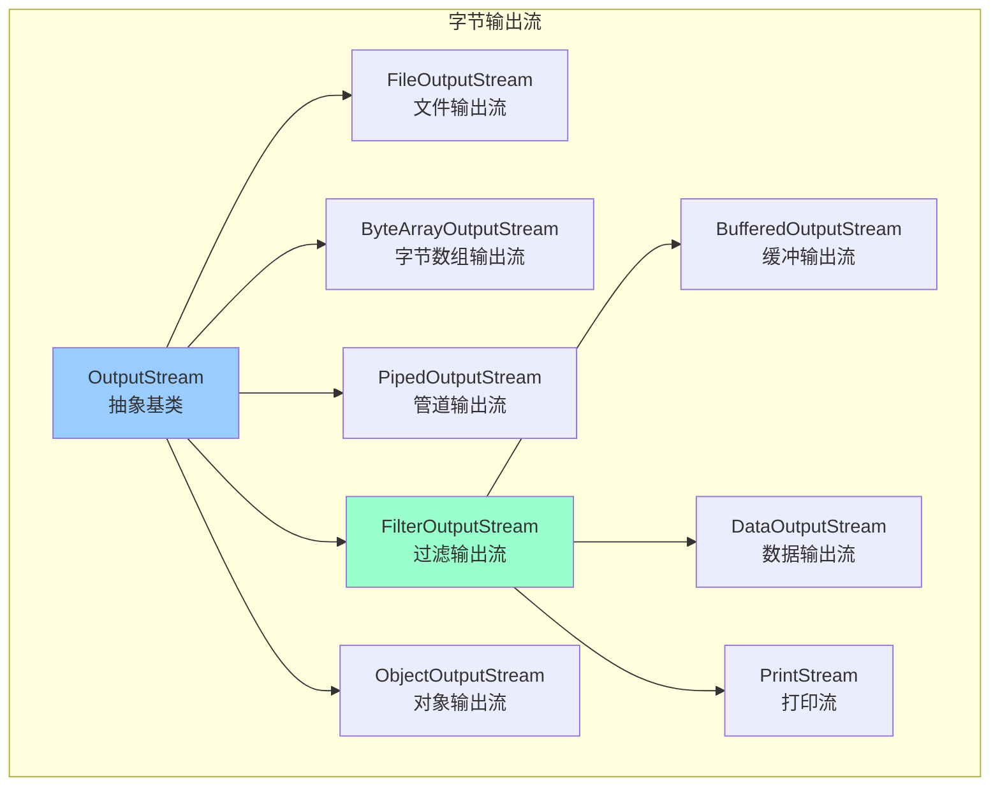
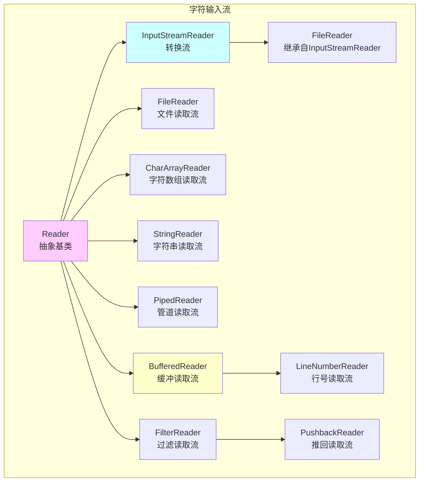
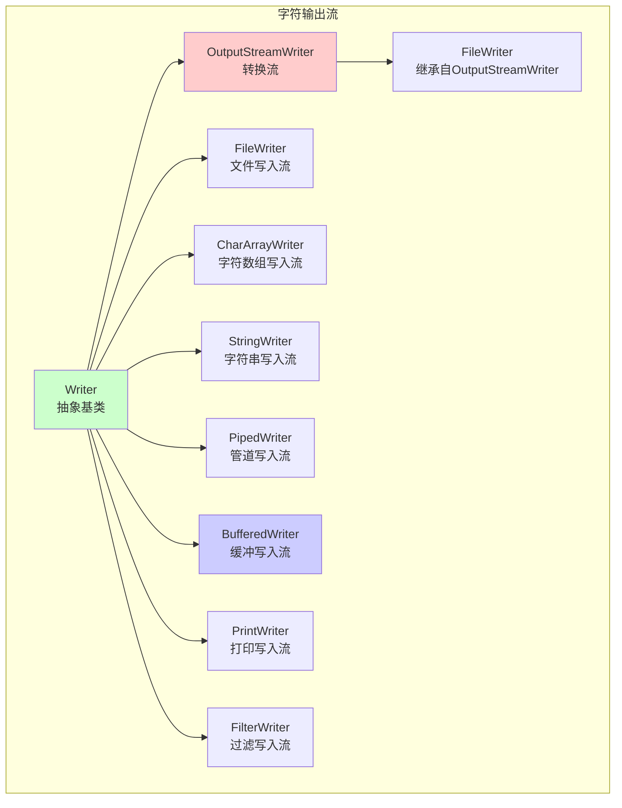
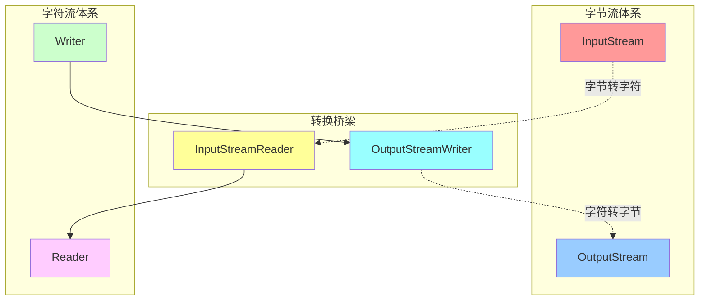

# Java IO 流继承体系

## 字节流继承体系





## 字符流继承体系





## 完整继承关系图



## 流的分类说明

### 按数据单位分类

1. **字节流**：以字节（8位）为单位进行数据传输
   - InputStream / OutputStream
   - 适合处理二进制数据（图片、音频、视频等）

2. **字符流**：以字符（16位）为单位进行数据传输
   - Reader / Writer
   - 适合处理文本数据，自动处理字符编码

### 按流向分类

1. **输入流**：从数据源读取数据到程序
   - InputStream / Reader

2. **输出流**：从程序写入数据到目的地
   - OutputStream / Writer

### 按功能分类

1. **节点流**：直接与数据源或目的地连接
   - FileInputStream、FileOutputStream
   - FileReader、FileWriter

2. **处理流**：对其他流进行包装，提供额外功能
   - BufferedInputStream、BufferedOutputStream
   - BufferedReader、BufferedWriter
   - DataInputStream、DataOutputStream
   - ObjectInputStream、ObjectOutputStream

## 常用流的使用场景

| 流类型 | 使用场景 | 特点 |
|--------|----------|------|
| FileInputStream/FileOutputStream | 读写文件的字节数据 | 适合二进制文件 |
| FileReader/FileWriter | 读写文件的字符数据 | 适合文本文件 |
| BufferedInputStream/BufferedOutputStream | 提高字节流读写效率 | 内部缓冲区 |
| BufferedReader/BufferedWriter | 提高字符流读写效率 | 内部缓冲区，支持按行读写 |
| InputStreamReader/OutputStreamWriter | 字节流与字符流转换 | 桥接流，可指定字符编码 |
| DataInputStream/DataOutputStream | 读写基本数据类型 | 保持数据类型 |
| ObjectInputStream/ObjectOutputStream | 读写对象（序列化） | 对象持久化 |
| PrintStream/PrintWriter | 格式化输出 | 提供print、println方法 |

## 使用示例

### 字节流读写文件

```java
// 使用 FileInputStream 和 FileOutputStream
try (FileInputStream fis = new FileInputStream("input.txt");
     FileOutputStream fos = new FileOutputStream("output.txt")) {
    byte[] buffer = new byte[1024];
    int len;
    while ((len = fis.read(buffer)) != -1) {
        fos.write(buffer, 0, len);
    }
}
```

### 字符流读写文件（带缓冲）

```java
// 使用 BufferedReader 和 BufferedWriter
try (BufferedReader br = new BufferedReader(new FileReader("input.txt"));
     BufferedWriter bw = new BufferedWriter(new FileWriter("output.txt"))) {
    String line;
    while ((line = br.readLine()) != null) {
        bw.write(line);
        bw.newLine();
    }
}
```

### 字节流转字符流

```java
// 使用 InputStreamReader 指定编码
try (InputStreamReader isr = new InputStreamReader(
        new FileInputStream("input.txt"), "UTF-8");
     BufferedReader br = new BufferedReader(isr)) {
    String line;
    while ((line = br.readLine()) != null) {
        System.out.println(line);
    }
}
```

### 对象序列化

```java
// 写入对象
try (ObjectOutputStream oos = new ObjectOutputStream(
        new FileOutputStream("object.dat"))) {
    oos.writeObject(myObject);
}

// 读取对象
try (ObjectInputStream ois = new ObjectInputStream(
        new FileInputStream("object.dat"))) {
    MyClass obj = (MyClass) ois.readObject();
}
```

## 注意事项

1. **及时关闭流**：使用 try-with-resources 自动关闭流，避免资源泄露
2. **使用缓冲流**：BufferedInputStream/BufferedReader 可以显著提高性能
3. **字符编码**：使用字符流时注意指定正确的字符编码
4. **异常处理**：IO 操作需要处理 IOException
5. **装饰器模式**：处理流采用装饰器模式，可以灵活组合功能
