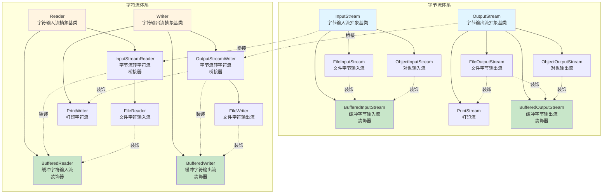

# Java IO 流继承与装饰体系

## 完整继承与装饰关系图



---

## 体系说明

### 一、四大抽象基类

| 分类 | 字节流 | 字符流 |
|------|--------|--------|
| **输入流** | InputStream | Reader |
| **输出流** | OutputStream | Writer |

---

### 二、字节流体系（InputStream / OutputStream）

#### 2.1 InputStream 主要实现类

| 类名 | 作用 | 类型 |
|------|------|------|
| **FileInputStream** | 从文件读取字节数据 | 节点流 |
| **ObjectInputStream** | 读取对象（反序列化） | 处理流 |
| **BufferedInputStream** | 提供缓冲功能，提高读取效率 | 装饰器 |

#### 2.2 OutputStream 主要实现类

| 类名 | 作用 | 类型 |
|------|------|------|
| **FileOutputStream** | 向文件写入字节数据 | 节点流 |
| **ObjectOutputStream** | 写入对象（序列化） | 处理流 |
| **PrintStream** | 提供打印功能（如 System.out） | 处理流 |
| **BufferedOutputStream** | 提供缓冲功能，提高写入效率 | 装饰器 |

---

### 三、字符流体系（Reader / Writer）

#### 3.1 Reader 主要实现类

| 类名 | 作用 | 类型 |
|------|------|------|
| **FileReader** | 从文件读取字符数据 | 节点流 |
| **InputStreamReader** | 字节流转字符流的桥接器 | 桥接器 |
| **BufferedReader** | 提供缓冲功能，支持按行读取 | 装饰器 |

#### 3.2 Writer 主要实现类

| 类名 | 作用 | 类型 |
|------|------|------|
| **FileWriter** | 向文件写入字符数据 | 节点流 |
| **OutputStreamWriter** | 字节流转字符流的桥接器 | 桥接器 |
| **BufferedWriter** | 提供缓冲功能，提高写入效率 | 装饰器 |
| **PrintWriter** | 提供打印功能，支持格式化输出 | 处理流 |

---

### 四、关键设计模式

#### 4.1 装饰器模式（Decorator Pattern）

装饰器模式用于动态地给对象添加额外的功能，而不改变其结构。

**典型应用：**

```java
// 使用 BufferedInputStream 装饰 FileInputStream
InputStream fis = new FileInputStream("file.txt");
InputStream bis = new BufferedInputStream(fis);  // 添加缓冲功能

// 使用 BufferedReader 装饰 FileReader
Reader fr = new FileReader("file.txt");
Reader br = new BufferedReader(fr);  // 添加缓冲和按行读取功能
```

**装饰器类特点：**
- 继承自抽象基类（如 InputStream、Reader）
- 构造方法接收同类型的对象作为参数
- 在原有功能基础上增强或添加新功能

---

#### 4.2 桥接器模式（Bridge Pattern）

桥接器用于连接字节流和字符流，实现编码转换。

**典型应用：**

```java
// 字节流转字符流（输入）
InputStream is = new FileInputStream("file.txt");
Reader isr = new InputStreamReader(is, "UTF-8");  // 指定编码

// 字节流转字符流（输出）
OutputStream os = new FileOutputStream("file.txt");
Writer osw = new OutputStreamWriter(os, "UTF-8");  // 指定编码
```

**桥接器类特点：**
- InputStreamReader：将 InputStream 转换为 Reader
- OutputStreamWriter：将 OutputStream 转换为 Writer
- 支持指定字符编码

---

### 五、常用组合模式

#### 5.1 高效文件读取

```java
// 字节流 + 缓冲
BufferedInputStream bis = new BufferedInputStream(
    new FileInputStream("file.txt")
);

// 字符流 + 缓冲 + 按行读取
BufferedReader br = new BufferedReader(
    new FileReader("file.txt")
);
String line;
while ((line = br.readLine()) != null) {
    System.out.println(line);
}
```

#### 5.2 对象序列化

```java
// 对象输出流
ObjectOutputStream oos = new ObjectOutputStream(
    new BufferedOutputStream(
        new FileOutputStream("object.dat")
    )
);
oos.writeObject(myObject);

// 对象输入流
ObjectInputStream ois = new ObjectInputStream(
    new BufferedInputStream(
        new FileInputStream("object.dat")
    )
);
MyObject obj = (MyObject) ois.readObject();
```

#### 5.3 字节流转字符流 + 缓冲

```java
// 读取
BufferedReader br = new BufferedReader(
    new InputStreamReader(
        new FileInputStream("file.txt"), 
        "UTF-8"
    )
);

// 写入
BufferedWriter bw = new BufferedWriter(
    new OutputStreamWriter(
        new FileOutputStream("file.txt"), 
        "UTF-8"
    )
);
```

---

### 六、流的分类

#### 6.1 按数据单位分类

| 分类 | 说明 | 代表类 |
|------|------|--------|
| **字节流** | 以字节（8 bit）为单位处理数据 | InputStream、OutputStream |
| **字符流** | 以字符（16 bit）为单位处理数据 | Reader、Writer |

**使用建议：**
- 处理文本文件：优先使用字符流
- 处理二进制文件（图片、视频等）：必须使用字节流

---

#### 6.2 按流的角色分类

| 分类 | 说明 | 代表类 |
|------|------|--------|
| **节点流** | 直接连接数据源 | FileInputStream、FileReader |
| **处理流** | 包装其他流，提供额外功能 | BufferedInputStream、BufferedReader |

**处理流的优势：**
- 提高性能（如缓冲流）
- 简化操作（如 BufferedReader.readLine()）
- 增强功能（如 ObjectInputStream 支持对象读取）

---

### 七、核心要点总结

1. **四大抽象基类**：InputStream、OutputStream、Reader、Writer
2. **字节流 vs 字符流**：字节流处理所有类型数据，字符流专门处理文本
3. **节点流 vs 处理流**：节点流直接连接数据源，处理流包装其他流
4. **装饰器模式**：通过包装增强功能，如 BufferedInputStream 包装 FileInputStream
5. **桥接器模式**：InputStreamReader 和 OutputStreamWriter 连接字节流和字符流
6. **缓冲流**：BufferedXXX 系列提供缓冲功能，显著提升 IO 性能
7. **关闭顺序**：先关闭外层流，再关闭内层流（实际上关闭外层流会自动关闭内层流）

---

### 八、使用建议

1. **优先使用缓冲流**：BufferedInputStream、BufferedReader 等可以显著提升性能
2. **及时关闭流**：使用 try-with-resources 自动关闭流，避免资源泄露
3. **选择合适的流**：
   - 文本文件 → 字符流（Reader/Writer）
   - 二进制文件 → 字节流（InputStream/OutputStream）
   - 需要对象序列化 → ObjectInputStream/ObjectOutputStream
4. **注意编码**：使用 InputStreamReader/OutputStreamWriter 时明确指定编码（如 UTF-8）
5. **合理组合**：根据需求组合使用节点流和处理流，如 BufferedReader + InputStreamReader + FileInputStream

---

## 面试常考点

### Q1: 字节流和字符流的区别？

**答：**
- **处理单位**：字节流以字节（8 bit）为单位，字符流以字符（16 bit）为单位
- **适用场景**：字节流可以处理所有类型的数据，字符流专门处理文本数据
- **编码问题**：字符流内部使用字符编码（如 UTF-8），字节流不涉及编码
- **性能**：处理文本时字符流更高效，因为减少了编码转换

### Q2: 什么是装饰器模式？在 IO 流中如何体现？

**答：**
装饰器模式是一种设计模式，用于在不改变对象结构的情况下动态地给对象添加新功能。

在 Java IO 中的体现：
- BufferedInputStream 装饰 FileInputStream，添加缓冲功能
- BufferedReader 装饰 FileReader，添加缓冲和按行读取功能
- 装饰器类和被装饰类都继承自同一个抽象基类

### Q3: 为什么要使用缓冲流？

**答：**
- **减少系统调用**：缓冲流内部维护一个缓冲区，减少了对底层系统的 IO 调用次数
- **提升性能**：批量读写数据比单字节/字符读写效率高得多
- **额外功能**：如 BufferedReader 提供 readLine() 方法，方便按行读取

### Q4: InputStreamReader 和 FileReader 的区别？

**答：**
- **InputStreamReader**：是字节流到字符流的桥接器，可以指定字符编码
- **FileReader**：继承自 InputStreamReader，使用系统默认编码，不能指定编码
- **推荐使用**：优先使用 InputStreamReader，因为可以明确指定编码，避免乱码问题

```java
// 推荐：可以指定编码
Reader reader = new InputStreamReader(new FileInputStream("file.txt"), "UTF-8");

// 不推荐：使用系统默认编码，可能导致乱码
Reader reader = new FileReader("file.txt");
```

### Q5: 如何正确关闭流？

**答：**
使用 try-with-resources 语句自动关闭流：

```java
// Java 7+ 推荐写法
try (BufferedReader br = new BufferedReader(new FileReader("file.txt"))) {
    String line;
    while ((line = br.readLine()) != null) {
        System.out.println(line);
    }
} catch (IOException e) {
    e.printStackTrace();
}
// 流会自动关闭，无需手动调用 close()
```

**注意事项：**
- 关闭外层流会自动关闭内层流
- 使用 try-with-resources 可以避免忘记关闭流导致的资源泄露
- 多个流可以在同一个 try 中声明，用分号分隔
